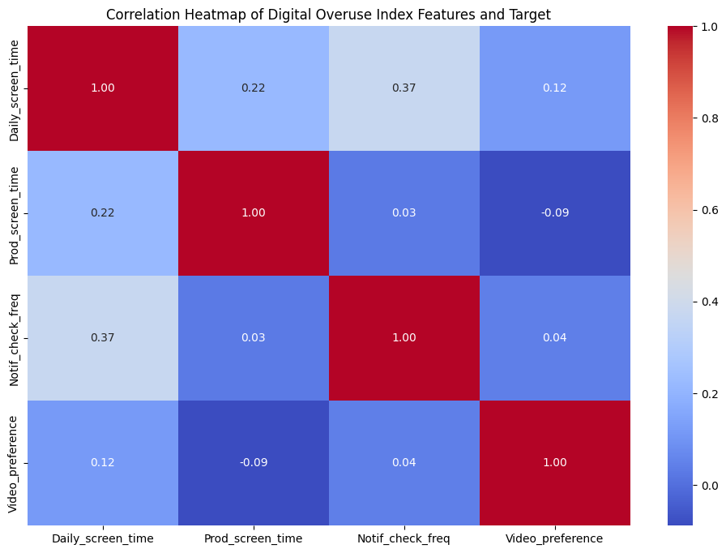
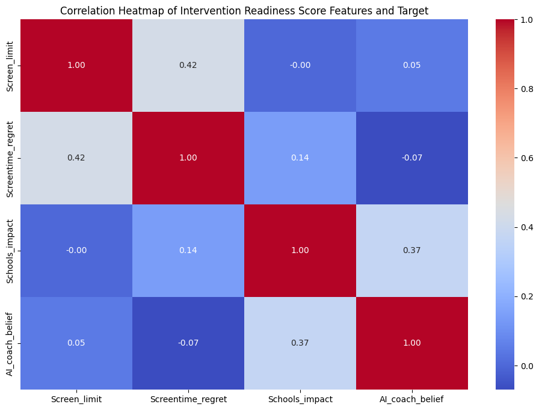

# DIGITAL BEHAVIOUR PREDICTION 

<b>Predicting Attention Fragmentation, Digital Overuse, and Intervention Readiness from Survey Data</b>

The project aims to analyze survey data on screen usage,productivity and behavioural patterns to predict Attention Fragmentation, Digital Overuse and Intervention Readiness using machine learning model.The goal is to understand behavioural factors and support AI-based and other digital well-being interventions.

The repository includes:

<ul> 
 <li> data_cleaning.py - Maps survey results for each question and checks for missing values </li>
 <li> feature_engineering.py - Calculates Attention Fragmentation Score, Digital Overuse Index and  Intervention Readiness Score</li>
 <li> train_AttentionFragmentationPrediction.py - To predict Attention Fragmentation from </li>
 <li> train_DigitalOverusePrediction.py - Run this file to predict Digital Overuse</li>
 <li> train_InterventionReadinessPrediction.py - Run this file to predict Intervention Readiness</li>
</ul>

## Dataset
- The dataset was collected in a survey as a part of a group reseach on 'DOPAMINE DYNAMICS IN THE DIGITAL AGE: UNDERSTANDING YOUTH AND ADULT BEHAVIOR AND AI DRIVEN INTERVENTIONS'
- Source: Survey of Adults aged 23 to 35
- Features: Daily Screen Time,Productive Screen Time, Notification Check Frequency, Video Preference(Reels/Long Form), Perceived Productivity Reduction, Regret from Screen Time, Usage of Screentime Limits,Barrier for limiting Screen Usage,Opinion on Impact of Dopamine Awareness at Schools and AI coach belief.
- Number of Participants: 61

## Features
- Attention Fragmentation Score Features: Daily Screen Time, Notification Check Frequency,Video Preference(Reels/Long Form),Perceived Productivity Reduction, Regret from Screen Time
- Digital Overuse Index: Daily Screen Time,Productive Screen Time, Notification Check Frequency,Video Preference(Reels/Long Form)
- Intervention Readiness Score: Regret from Screen Time, Usage of Screentime Limits, Opinion on impact of Dopamine awareness at schools, AI coach belief

## Target Variables - Binary Classification
- Attention Fragmentation Class
- Digital Overuse Class
- Intervention Readiness Class

## Methods
- Data cleaning and Precprocessing
- Exporatory Data Analysis: Correlation Heatmap,Distributions,Feature Importance Analysis,Confusion Matrix
- Machine Learning Model: Logistic Regression for classification
- Train-test split, Cross-validation and Accuracy evaluation

## Results
<table border="1" cellpadding="8" cellspacing="0">
  <thead>
    <tr>
      <th>Metric / Feature</th>
      <th>Attention Fragmentation (AF)</th>
      <th>Digital Overuse Index (DOI)</th>
      <th>Intervention Readiness (IR)</th>
    </tr>
  </thead>
  <tbody>
    <tr>
      <td>Model Accuracy (%)</td>
      <td>95%</td>
      <td>95%</td>
      <td>100%</td>
    </tr>
    <tr>
      <td>Top Feature 1</td>
      <td>Screentime_regret</td>
      <td>Video_preference</td>
      <td>Screentime_regret</td>
    </tr>
    <tr>
      <td>Top Feature 2</td>
      <td>Perceived_prod_reduction</td>
      <td>Prod_screen_time</td>
      <td>Schools_impact</td>
    </tr>
    <tr>
      <td>Top Feature 3</td>
      <td>Daily_screen_time</td>
      <td>Notif_check_freq</td>
      <td>AI_coach_belief</td>
    </tr>
    <tr>
      <td>Top Feature 4</td>
      <td>Notif_check_freq</td>
      <td>Daily_screen_time</td>
      <td>Screen_limit</td>
    </tr>
    <tr>
      <td>Top Feature 5</td>
      <td>Video_preference	</td>
      <td>-</td>
      <td>-</td>
    </tr>
  </tbody>
</table>
 
 ## Plots

### Correlation Heatmap of Attention Fragmentation

### Correlation Heatmap of Digital Overuse

### Correlation Heatmap of Intervention Readiness

## Installation
- Clone the repository:

https://github.com/ASMAABDULSAMATHE/Digital-Behavior-Prediction-ML.git

- Change Folder : cd Digital-Behavior-Prediction-ML
- Run code:
<ol> 
 <li> data_cleaning.py </li>
 <li> feature_engineering.py</li>
 <li> train_AttentionFragmentationPrediction - Run this file to predict Attention Fragmentation</li>
 <li> train_DigitalOverusePrediction - Run this file to predict Digital Overuse</li>
 <li> train_InterventionReadinessPrediction - Run this file to predict Intervention Readiness</li>
</ol>

## Dependencies
- Python 3.x
- pandas, numpy, seaborn, matplotlib, scikit-learn

## Future Improvements
- Use diverse and larger datasets
- Include real-time behavioural datasets
- Test other predictive machine learning models
- Explore adaptive and predictive interventions

## Author

Asma Abdul Samathe
